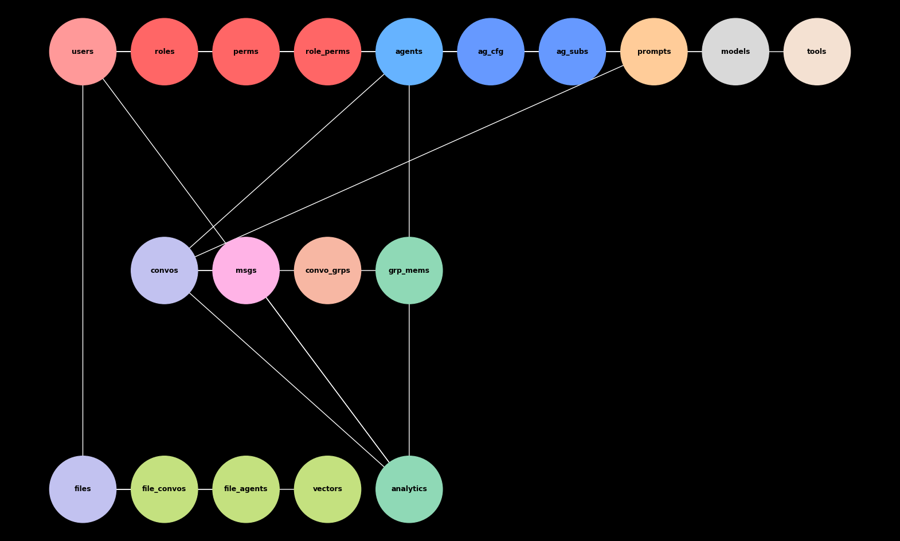

## Overview

The Jutsu "App Hub" architecture is designed to provide a comprehensive and dynamic platform for creating, managing, and interacting with AI agents and their associated contexts. At the heart of this system is a robust user management framework that allows individuals to seamlessly integrate various functionalities and tools to enhance their interaction with AI models.

## Core Features

### User Management

The architecture allows users to:
- Create, manage, and interact with multiple threads and agents.
- Upload and manage multi-modal contexts, including PDFs, images, videos, and audio files.
- Provide comprehensive and rich data inputs to AI agents, enhancing interaction quality and contextual relevance.

### Threads and Conversations

Users can:
- Initiate threads, which are chatbot conversations with selected AI models such as GPT-4 or Claude 3.5.
- Ensure threads retain long-term memory, enabling users to search through and revisit past conversations.
- Maintain a cohesive and continuous interaction history with AI agents.

### Thread Groups

The system allows:
- Organizing threads into dynamic thread groups, facilitating better management and contextual grouping of conversations.
- Drawing context from thread groups for future dialogues, enhancing the relevance and continuity of interactions.

### Multi-Modal Context Management

Users have the ability to:
- Upload multi-modal context files and link them to threads or thread groups.
- Dynamically add or remove files from threads/thread groups, effectively organizing and sharing context.
- Ensure that AI agents have access to a wide range of contextual information, improving their response accuracy and relevance.

### Agent Threads

The platform supports:
- Publishing agent threads as simple prompt-engineered agents.
- Sharing agent threads via a unique URL, allowing other users to access and interact with the same context and knowledge base.
- Assigning various access permissions to published agent threads, such as public access or invite-only access.

### Prompt Template Registry

Users can:
- Search through a registry of pre-built prompt engineering templates.
- Load templates into new threads, providing a starting point for creating new agent threads.
- Publish their own agent threads into the prompt template registry for others to use, fostering collaboration and knowledge sharing.

### Subscriptions and Access Control

The system manages:
- User subscriptions to published agent threads, tracking which users have access to which agents.
- Access permissions, ensuring that only authorized users can interact with certain agent threads.
- Subscription management, allowing users to subscribe or unsubscribe from agent threads as needed.

### Tools Integration

Agents in the system can:
- Use various tools to perform specific tasks or access external services.
- Be linked to tools, which are managed and integrated within the agent threads.
- Enhance their functionality and extend their capabilities through tool integration.

### Retrieval-Augmented Generation (RAG)

The architecture includes:
- A sophisticated RAG system for efficient data retrieval and augmentation.
- A vector database that stores vectorized representations of documents, conversations, and other data.
- Enhanced data management and retrieval capabilities, ensuring that AI agents can access and use relevant information effectively.

### Applications and Agent Types

The system supports:
- Different application contexts, allowing for versatile use cases and interactions.
- Various agent types, enabling users to create and manage different kinds of agents such as chatbot agents, data retrieval agents, and more.
- A flexible and extensible framework that can adapt to evolving user needs and technological advancements.

## Database Schema

### Entity Overview

- **users**: Central to the system, mapping all user interactions.
- **applications**: Represents different application contexts within the agent platform.
- **agent_types**: Defines different types of agents that can be loaded within applications.
- **threads**: Represents individual conversations with a model, linked to users, models, applications, and agent types.
- **conversations**: Represents individual message exchanges within a thread, linked to threads.
- **thread_groups**: Allows users to organize threads, linked to users and threads.
- **files**: Manages multi-modal content, linked to users, threads, and thread groups.
- **agent_threads**: Published threads with prompt engineering, linked to threads and users, with access control.
- **prompt_templates**: Stores reusable prompt engineering templates, linked to users and threads.
- **models**: Stores model details, linked to threads.
- **agent_subscriptions**: Manages user subscriptions to published agent threads.
- **tools**: Represents tools that agents can use, linked to agent threads.
- **vectors**: Manages vectorized data for efficient retrieval in the RAG system, linked to various entities.

### Entity Diagram

The below diagram indicates high-level entity relationships within the database schema.

### Entity Table

| Table Name               | Description                                                                                     | Primary Key         | Foreign Keys                                                                                                       |
|--------------------------|-------------------------------------------------------------------------------------------------|---------------------|-------------------------------------------------------------------------------------------------------------------|
| users                    | Individuals who use the App Hub platform.                                                       | `user_id`           | -                                                                                                                 |
| applications             | Different contexts where various types of agents can be loaded and used.                        | `application_id`    | -                                                                                                                 |
| agent_types              | Different kinds of agents supported by the platform.                                            | `agent_type_id`     | -                                                                                                                 |
| threads                  | Containers for entire interaction sessions or topics between a user and an agent.               | `thread_id`         | `user_id`, `model_id`, `application_id`, `agent_type_id`                                                          |
| conversations            | Individual message exchanges within a thread.                                                   | `conversation_id`   | `thread_id`                                                                                                       |
| thread_groups            | Collections of threads organized by the user.                                                   | `group_id`          | `user_id`                                                                                                         |
| thread_group_memberships | Links threads to thread groups.                                                                 | -                   | `group_id`, `thread_id`                                                                                           |
| files                    | Files such as PDFs, images, videos, and audio.                                                  | `file_id`           | `user_id`                                                                                                         |
| file_thread_mappings     | Links files to threads.                                                                         | -                   | `file_id`, `thread_id`                                                                                            |
| file_group_mappings      | Links files to thread groups.                                                                   | -                   | `file_id`, `group_id`                                                                                            |
| agent_threads            | Published threads with prompt engineering.                                                      | `agent_id`          | `thread_id`, `user_id`                                                                                            |
| agent_invites            | Manages invitations to access agent threads.                                                    | `invite_id`         | `agent_id`, `invited_user_id`                                                                                     |
| prompt_templates         | Stores reusable prompt engineering templates.                                                   | `template_id`       | `user_id`                                                                                                         |
| prompt_template_usages   | Links prompt templates to threads where they are used.                                          | `usage_id`          | `template_id`, `thread_id`                                                                                        |
| models                   | Represents different AI models available for interaction within threads.                        | `model_id`          | -                                                                                                                 |
| agent_subscriptions      | Manages subscriptions of users to published agent threads.                                      | `subscription_id`   | `user_id`, `agent_id`                                                                                            |
| tools                    | Represents tools that agents can use.                                                           | `tool_id`           | -                                                                                                                 |
| agent_tools              | Links tools to agent threads.                                                                   | -                   | `agent_id`, `tool_id`                                                                                             |
| vectors                  | Stores vectorized representations of data for efficient retrieval in the RAG system.            | `vector_id`         | `entity_id` (ID of associated entity), `entity_type` (Type of the entity, e.g., file, conversation)               |

### Entity Attributes

#### Users
**Definition**: Individuals who use the App Hub platform, capable of creating, managing, and interacting with various threads and agents.

- **users**
  - `user_id` (Primary Key)
  - `username`
  - `email`
  - `password_hash`
  - `created_at`
  - `updated_at`

#### Applications
**Definition**: Different contexts within the App Hub where various types of agents can be loaded and used.

- **applications**
  - `application_id` (Primary Key)
  - `name`
  - `description`
  - `created_at`
  - `updated_at`

#### Agent Types
**Definition**: Different kinds of agents supported by the platform, such as chatbot agents, data retrieval agents, etc.

- **agent_types**
  - `agent_type_id` (Primary Key)
  - `name`
  - `description`
  - `created_at`
  - `updated_at`

#### Threads
**Definition**: Containers for entire interaction sessions or topics between a user and an agent, maintaining the context of the conversation.

- **threads**
  - `thread_id` (Primary Key)
  - `user_id` (Foreign Key referencing users)
  - `model_id` (Foreign Key referencing models)
  - `title`
  - `created_at`
  - `updated_at`
  - `application_id` (Foreign Key referencing applications)
  - `agent_type_id` (Foreign Key referencing agent_types)

#### Conversations
**Definition**: Individual message exchanges within a thread, representing the dialogue between a user and an agent.

- **conversations**
  - `conversation_id` (Primary Key)
  - `thread_id` (Foreign Key referencing threads)
  - `message`
  - `timestamp`
  - `role` (user, assistant)

#### Thread Groups
**Definition**: Collections of threads organized by the user, allowing for better management and contextual grouping of conversations.

- **thread_groups**
  - `group_id` (Primary Key)
  - `user_id` (Foreign Key referencing users)
  - `name`
  - `description`
  - `created_at`
  - `updated_at`

- **thread_group_memberships**
  - `group_id` (Foreign Key referencing thread_groups)
  - `thread_id` (Foreign Key referencing threads)
  - `added_at`

#### Multi-Modal Contexts
**Definition**: Files such as PDFs, images, videos, and audio that users can upload and link to threads or thread groups, providing additional context for conversations.

- **files**
  - `file_id` (Primary Key)
  - `user_id` (Foreign Key referencing users)
  - `file_name`
  - `file_type`
  - `file_url`
  - `uploaded_at`

- **file_thread_mappings**
  - `file_id` (Foreign Key referencing files)
  - `thread_id` (Foreign Key referencing threads)
  - `added_at`

- **file_group_mappings**
  - `file_id` (Foreign Key referencing files)
  - `group_id` (Foreign Key referencing thread_groups)
  - `added_at`

#### Agent Threads
**Definition**: Published threads with prompt engineering that can be shared and accessed by other users, allowing for collaborative use and extension of conversation contexts.

- **agent_threads**
  - `agent_id` (Primary Key)
  - `thread_id` (Foreign Key referencing threads)
  - `user_id` (Foreign Key referencing users)
  - `is_published`
  - `access_type` (public, invite-only)
  - `created_at`
  - `updated_at`
  - `unique_url` (Unique URL generated from agent_id, thread_id, and user_id)

- **agent_invites**
  - `invite_id` (Primary Key)
  - `agent_id` (Foreign Key referencing agent_threads)
  - `invited_user_id` (Foreign Key referencing users)
  - `invited_at`

#### Prompt Template Registry
**Definition**: Stores reusable prompt engineering templates that users can search and load into new thread instances, providing a starting point for creating new agents.

- **prompt_templates**
  - `template_id` (Primary Key)
  - `user_id` (Foreign Key referencing users)
  - `title`
  - `description`
  - `prompt`
  - `created_at`
  - `updated_at`

- **prompt_template_usages**
  - `usage_id` (Primary Key)
  - `template_id` (Foreign Key referencing prompt_templates)
  - `thread_id` (Foreign Key referencing threads)
  - `used_at`

#### Models
**Definition**: Represents different AI models available for interaction within threads, such as GPT-4, Claude 3.5, etc.

- **models**
  - `model_id` (Primary Key)
  - `name`
  - `version`
  - `description`
  - `created_at`
  - `updated_at`

#### Agent Subscriptions
**Definition**: Manages subscriptions of users to published agent threads, tracking which users have access to which agents.

- **agent_subscriptions**
  - `subscription_id` (Primary Key)
  - `user_id` (Foreign Key referencing users)
  - `agent_id` (Foreign Key referencing agent_threads)
  - `subscribed_at`

#### Tools
**Definition**: Represents tools that agents can use, enabling them to perform specific tasks or access external services.

- **tools**
  - `tool_id` (Primary Key)
  - `name`
  - `description`
  - `created_at`
  - `updated_at`

- **agent_tools**
  - `agent_id` (Foreign Key referencing agent_threads)
  - `tool_id` (Foreign Key referencing tools)
  - `added_at`

#### Vectors
**Definition**: Stores vectorized representations of documents, conversations, and other data to enable efficient retrieval and augmentation.

- **vectors**
  - `vector_id` (Primary Key)
  - `entity_id` (ID of the associated entity, e.g., file_id, conversation_id)
  - `entity_type` (Type of the entity, e.g., file, conversation)
  - `vector` (Vector representation of the data)
  - `source` (Source of the data, e.g., user-uploaded, generated by agent)
  - `embedding_model` (Model used to generate the vector, e.g., GPT-4, BERT)
  - `embedding_version` (Version of the embedding model)
  - `embedding_type` (Type of embedding, e.g., text, image, audio)
  - `created_at`
  - `updated_at`
  - `version` (Version of the vector representation)